# Jim's Bar & Grill

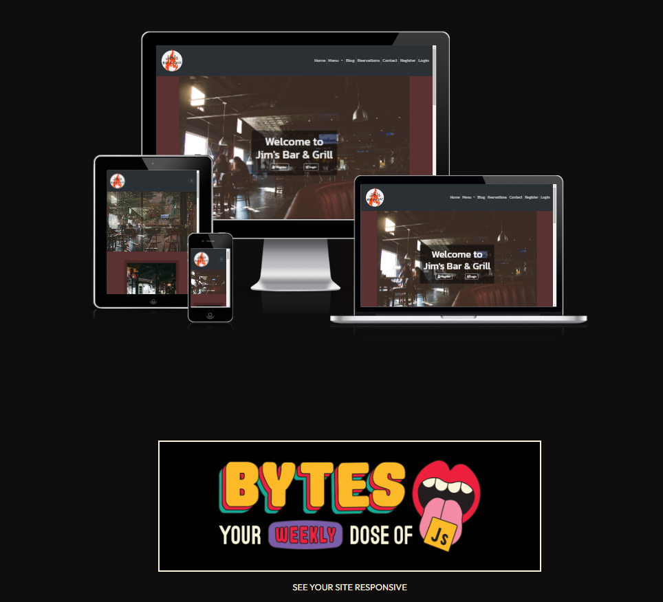

**Developer: James Lynch**

💻 [Visit live website](https://jims-bar-and-grill.herokuapp.com/)

## Table of Contents
  - [About](#about)
  - [User Goals](#user-goals)
  - [Site Owner Goals](#site-owner-goals)
  - [User Experience](#user-experience)
  - [User Stories](#user-stories)
  - [Design](#design)
    - [Colours](#colours)
    - [Fonts](#fonts)
    - [Structure](#structure)
      - [Website pages](#website-pages)
      - [Database](#database)
    - [Wireframes](#wireframes)
  - [Technologies Used](#technologies-used)
  - [Features](#features)
  - [Validation](#validation)
  - [Testing](#testing)
    - [Manual testing](#manual-testing)
    - [Automated testing](#automated-testing)
    - [Tests on various devices](#tests-on-various-devices)
    - [Browser compatibility](#browser-compatibility)
  - [Bugs](#bugs)
  - [Heroku Deployment](#heroku-deployment)
  - [Credits](#credits)
  - [Acknowledgements](#acknowledgements)

### About

Jim's Bar & Grill is a fictional business where users can create an account, book a table, read a blog and view the food and drinks menu.

### User Goals

- To create a table booking
- To be able to view edit and cancel bookings
- To view menus, a blog and contact info

### Site Owner Goals

- To provide a solution to allow users to book a table online
- To attract more business with a well crafted site
- Provide a modern application with an easy navigation
- Fully responsive and accessible

## User Experience

### Target Audience

- Users that wish to book a table for a meal or a party with family and friends
- Past and new customers for the business
- Tourists visiting the area that are looking for a meal or a drink or both
- Fans visiting the area for a sports event or a music concert
- People employed in the area to eat and drink after work

### User Requirements and Expectations

- Fully responsive
- Accessible
- A welcoming design
- Social media
- Contact information
- Accessibility

##### Back to [top](#table-of-contents)

## User Stories

### As a website user: 

1. I want a site in which I can view a contact us page to get in touch with the business (Required)
2. I want a site in which i can view view blog posts so i can read articles and get a better sense of the restaurant (Should have)
3. I want a site in which i can like a blog post so I  can interact with the restaurant (Should have)
4. I want a site I can view comments the restaurant's blog posts so I can see what other people thinks about about the posts (Should have)
5. I want a site I can create and register an account which stores my details for faster bookings (Required)
6. I want a site I can create a comment for a blog so I can converse with the restaurant and its community (Should have)
7. I Want a site I can view the amount of likes on a blog post so i can see if the post is highly rated (Should have)
8. I want a site I can navigate through easily and have all features accessible (Required)
9. I want a site in which I have full use of all navbar, body, footer and icon features so that I can navigate the site views, forms, access requests, and access socials (Required)
10. I want a site I can view paginated blog posts so the there's not too much information being shown (Should have)
11. I want a site i can provide a contact us page so that users can reach out to the business (Required)
12. I want a site I can not double book a table as it would be invalid (Required)
13.	I want a site that I can view the opening hours, contact details, an address along with a map so that I know where the business is located and when the business is open along with how to contact them via email, phone and socials (Required)
14. I want a site I can view a menu option so that I can decide wether to eat at the business (Required)
15. I want a site in which i am unable to book a table in the past as i would be invalid (Required)
16. I want a site in which i can view a notifaction so that I know if my action of creation, edit, or deletion of a booking has been confirmed (Required)
17.	I want a site I can delete my booking so that I can cancel my table reservation (Required)
18.  I want a site where i can view all my booking requests with the date and time (Required)
19.	I want a site I can request a booking by selecting a time and date so that I can reserve a table (Required)
20.	I want a site I can update my booking so that I can choose another available date and time (Required)
21.	I want a site I can create a booking so that I reserve a table (Required)
22. I want a site I can view a confirmation of my booking (Required)

### Admin / Authorised User

1. As an Admin / Authorised User I can acces the backend of the site by logging in (Required)
2. As an Admin / Authorised User I can manually manage all blog content on site (Required)
3. As an Admin / Authorised User I can review bookings as to check if any double bookings were registered (Required)
4. As an Admin / Authorised User I can access the back end of the site to create, edit and delete any of the menu options (Required)
5. As an Admin / Authorised User I can search through reservations and menu items should i require that information (Should have)
6. As an Admin / Authorised User I can view filtered bookings based on the name, email and date (Should have)
7. As an Admin / Authorised User I can manually create, edit or delete a reservation should a customer request (Should have)

### Site Owner  

1. As a Site Owner I want to provide a easy to use site with all relevent information displayed while being fully responsive (Required)
2. As a Site Owner I want a site were all data entered is validated catalogued correctly without any errors (Required)

### Kanban, Epics & User Stories

- GitHub Kanban boards were used to visualize project progress
- The label feature in github was used to create Epics
- Todo, In Progress and Done labels were used in the kanban

User Stories

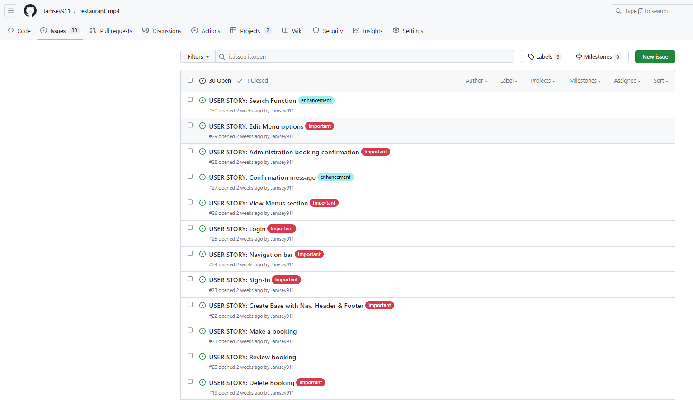
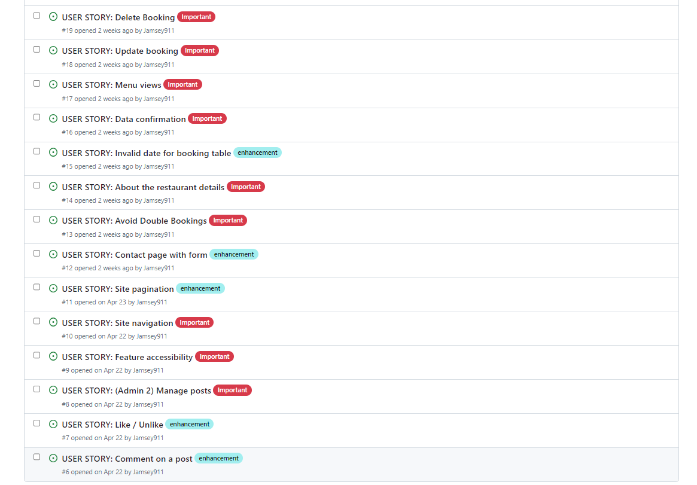
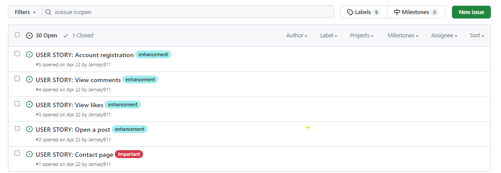

Kanban

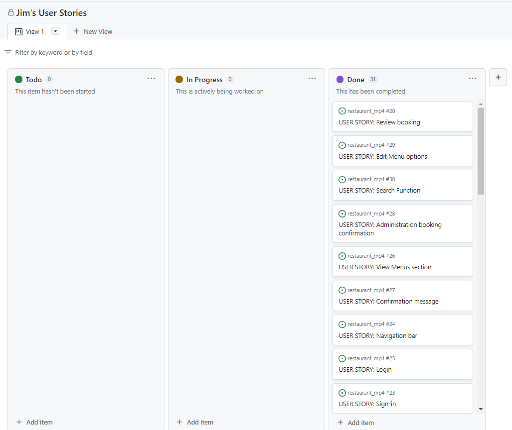
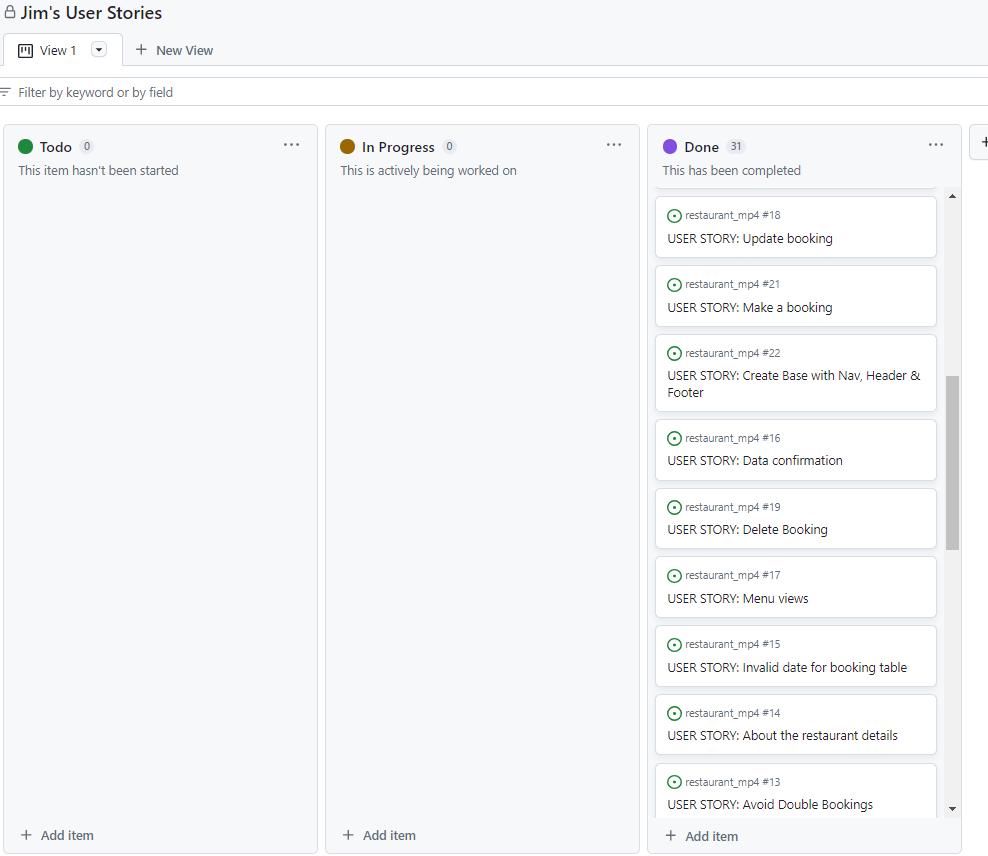
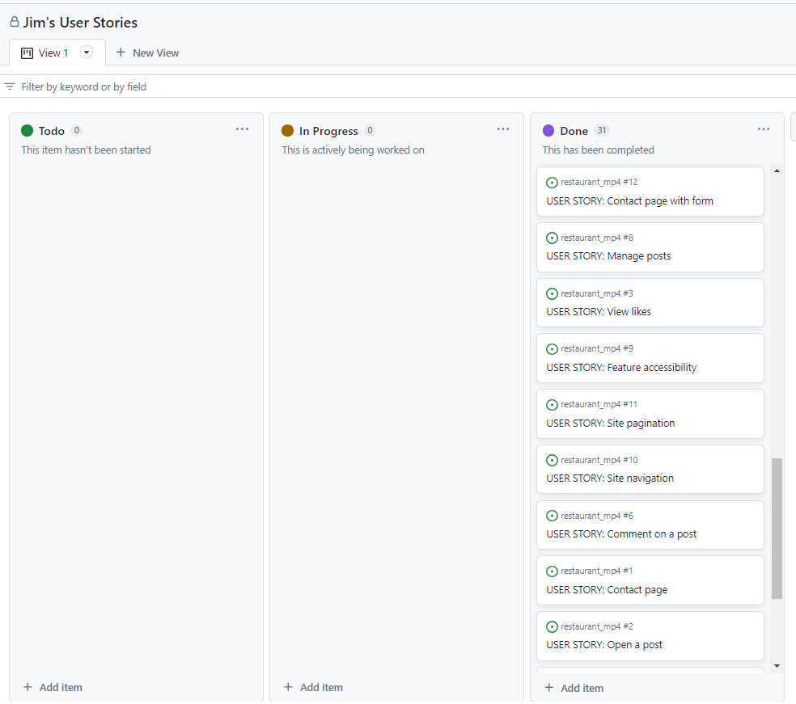
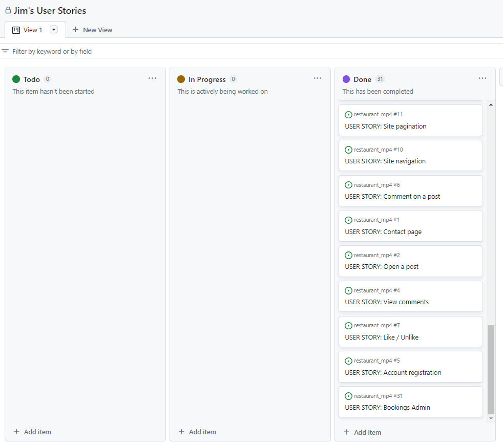

##### Back to [top](#table-of-contents)

## Design

### Design Choices

My goal is to create a welcoming yet efficent website so people of all ages feel at ease while they navigate through the content. In order to achieve this, all relevant content is made easy to read in the index with links to the sign up page for any upcoming events that are taking place. Another seperate page to book for a party and another page with all relevant contact information.

### Colour
 The colour sheme was chosen as a dark blue and dark red theme, and was also aided by colorhexa in which a Split Complementary Color was selected. A light grey and soft yellow was used to give it contrast which was selected through adobe color. A slighly soft red was selected for certain alerts in the events page.
 
 

### Fonts
Libre Baskerville was used for the logo and main headings. 
 
Libre Franklin was used for the sub-heading's and smaller body elements. 
 
The fonts were chosen because the Libre Baskerville matched some of the illustraitions in the arcade. The match for this font was made through fontjoy.
 
San-serif was used as my backup.

### Structure
The page is structured in a simple and recognizable way with it being user friendly so anybody can find it easy to learn. The home page is designed to have all relevanet information once opened. The logo is postioned on the left, navigation on the right and this is shown on all pages in the same layout. The design is created also to collaspe on itself when being viewed in differnt viewports while maintaing all relevant information: 
- A homepage with sections for the bookings section and upcoming events section
- A bookings page with relevant information
- A events page in which in which you can sign up for an upcoming event
- A contacts page with a message section to contact the Arcade

### Wireframes

Home

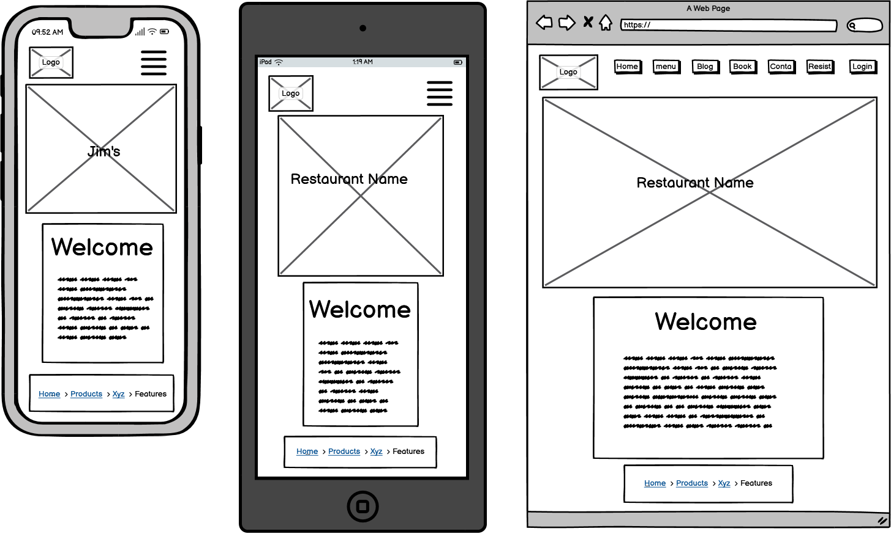
(docs/features/kanban-1.png)

Menu

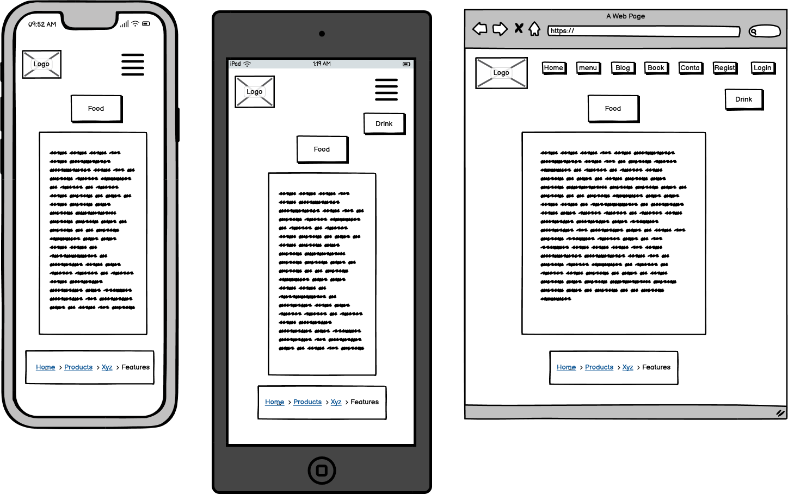

Blog

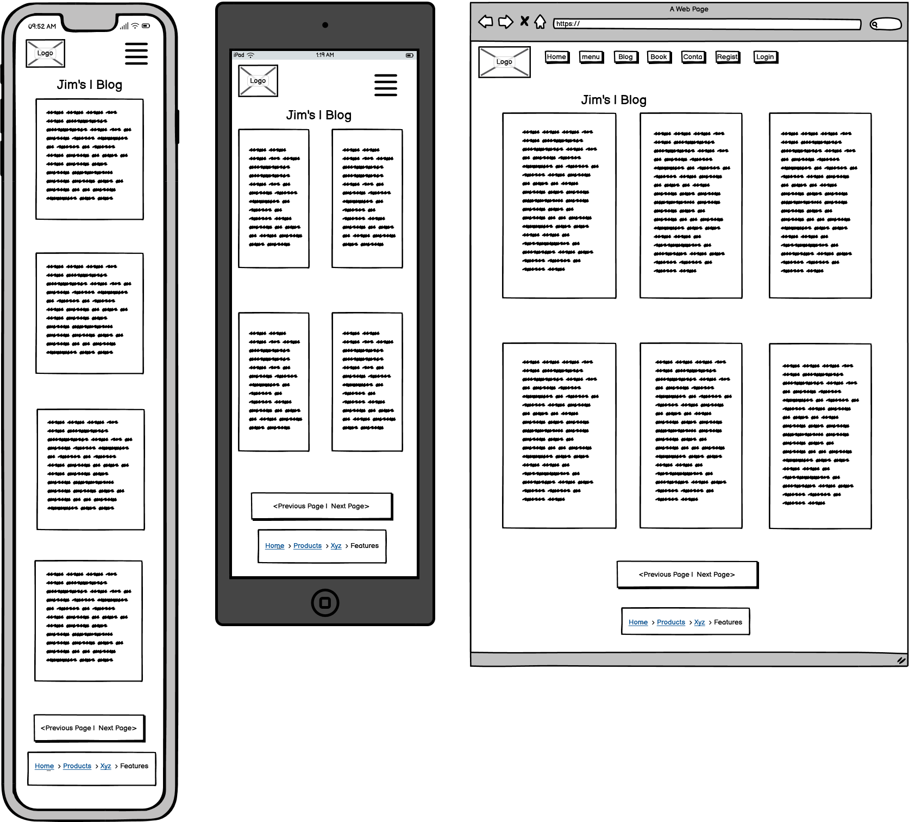

Reservations

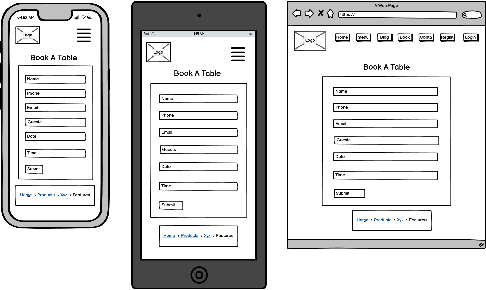

Contact

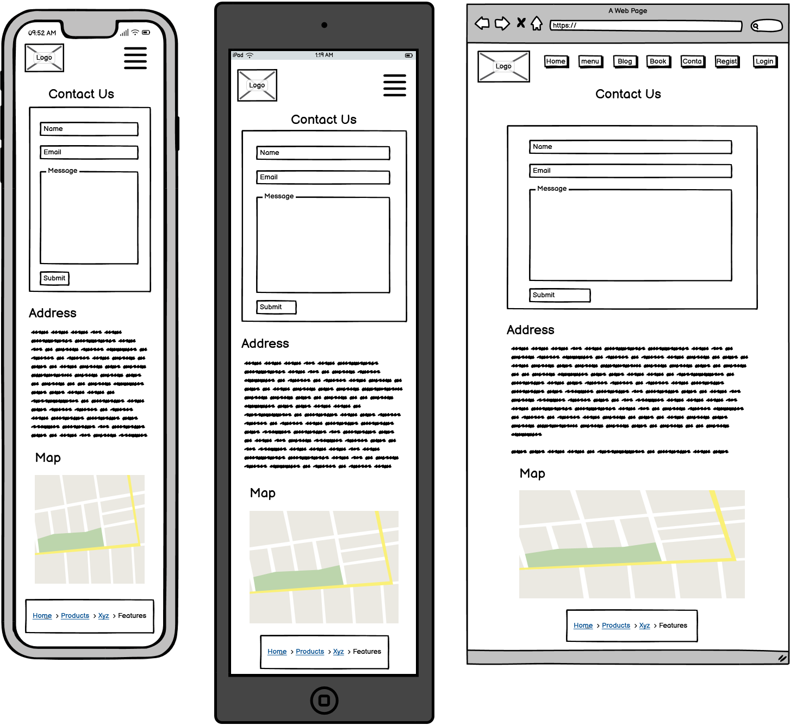

Register

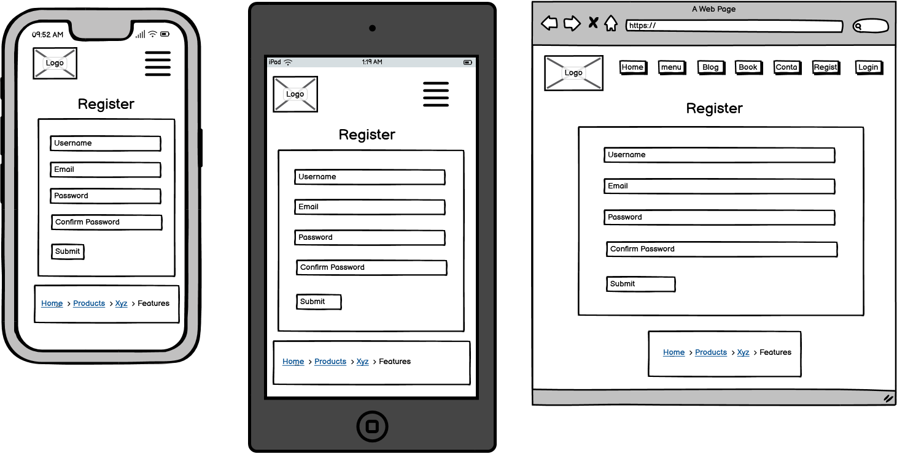

Log In/Details

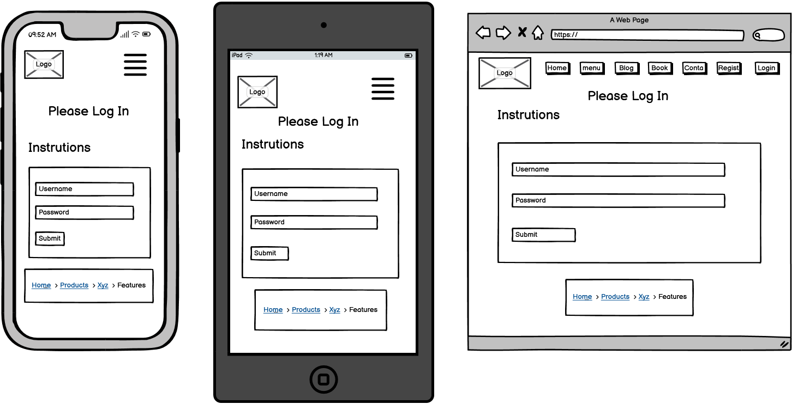

404

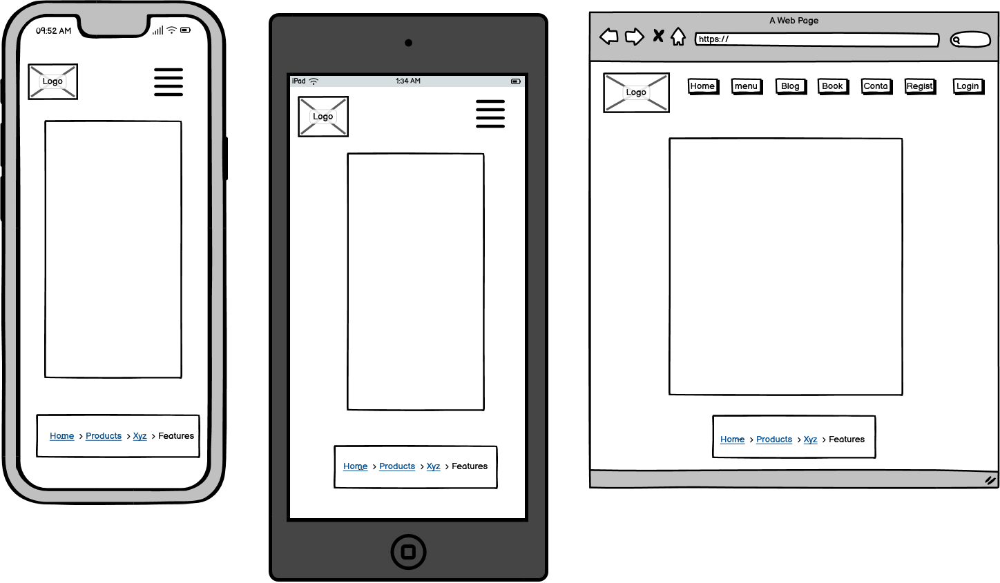

