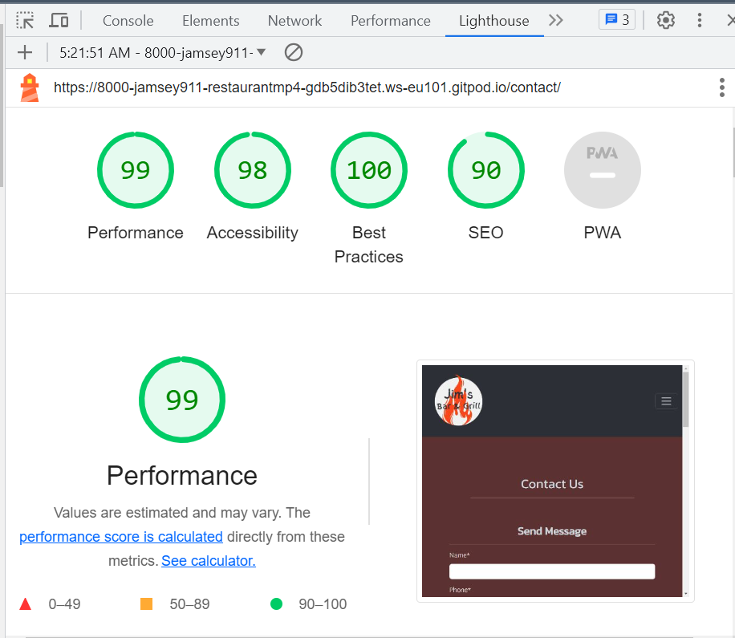
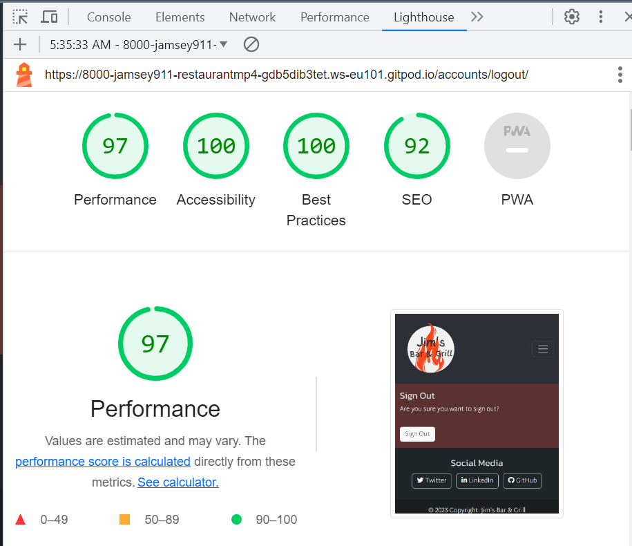
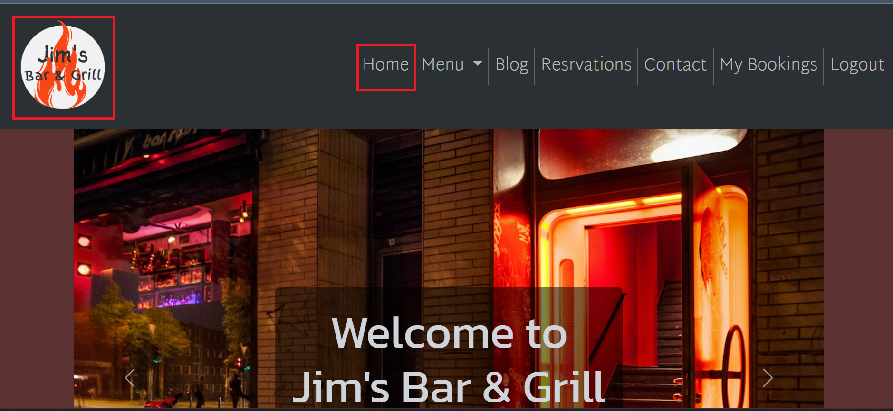
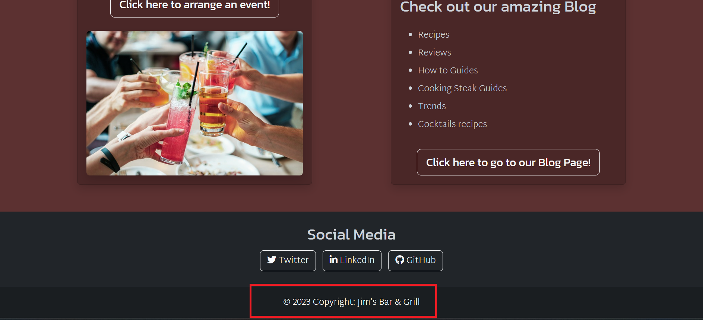
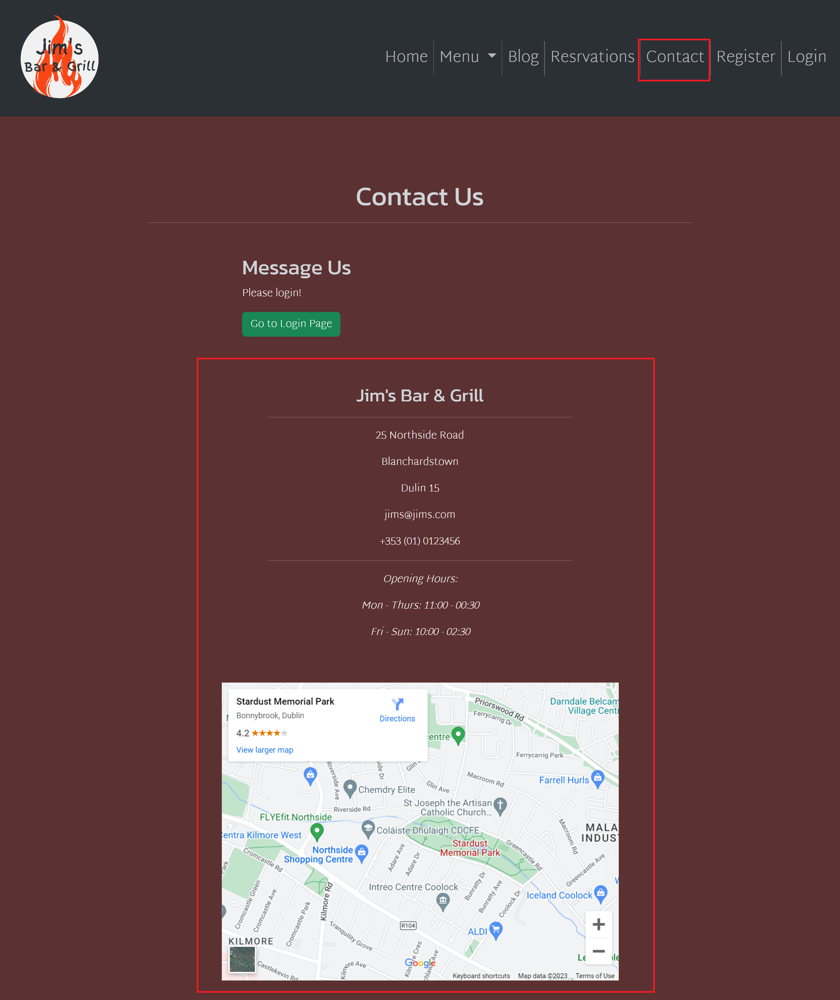
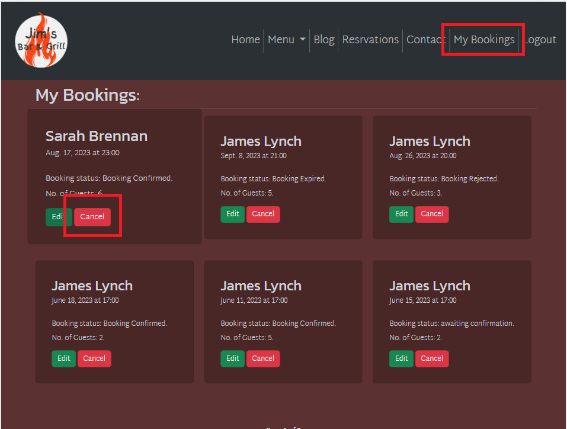
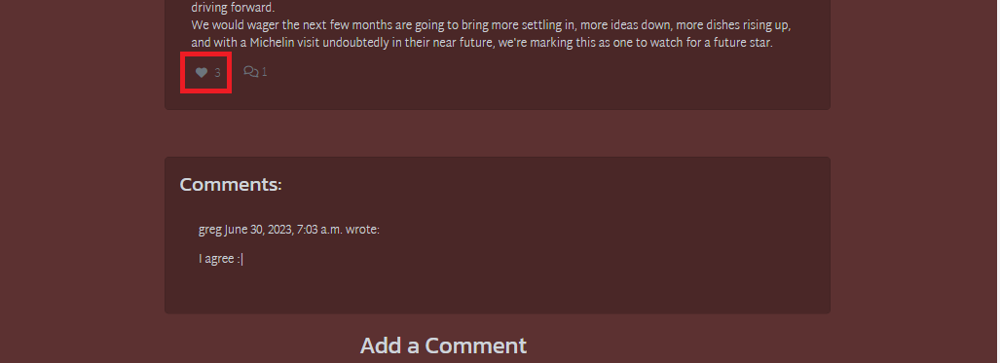
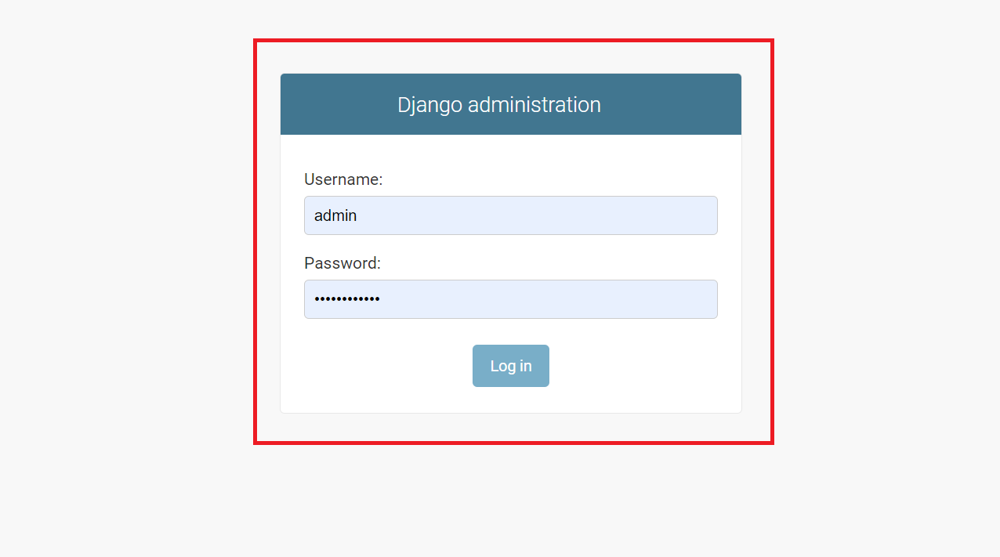
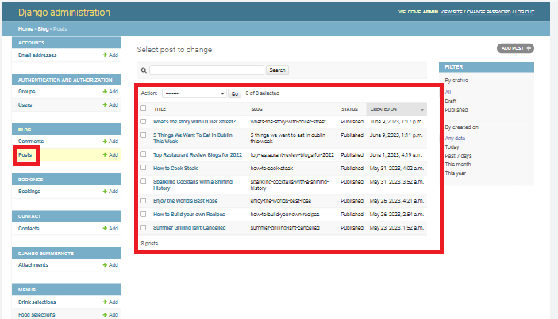
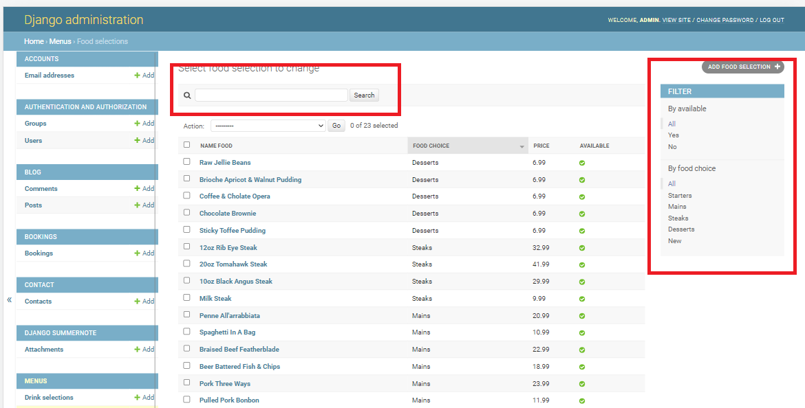

# Jim's Bar & Grill

**Developer: James Lynch**

💻 [Visit live website](https://jims-bar-and-grill.herokuapp.com/)

## Table of Contents
  - [About](#about)
  - [User Goals](#user-goals)
  - [Site Owner Goals](#site-owner-goals)
  - [User Experience](#user-experience)
  - [User Stories](#user-stories)
  - [Design](#design)
    - [Colours](#colours)
    - [Fonts](#fonts)
    - [Structure](#structure)
      - [Website pages](#website-pages)
      - [Database](#database)
    - [Wireframes](#wireframes)
  - [Technologies Used](#technologies-used)
  - [Features](#features)
  - [Validation](#validation)
  - [Testing](#testing)
    - [Manual testing](#manual-testing)
    - [Automated testing](#automated-testing)
    - [Tests on various devices](#tests-on-various-devices)
    - [Browser compatibility](#browser-compatibility)
  - [Bugs](#bugs)
  - [Heroku Deployment](#heroku-deployment)
  - [Credits](#credits)
  - [Acknowledgements](#acknowledgements)

### About

Jim's Bar & Grill is a fictional business where users can create an account, book a table, read a blog and view the food and drinks menu.

### User Goals

- To create a table booking
- To be able to view edit and cancel bookings
- To view menus, a blog and contact info

### Site Owner Goals

- To provide a solution to allow users to book a table online
- To attract more business with a well crafted site
- Provide a modern application with an easy navigation
- Fully responsive and accessible

## User Experience

### Target Audience

- Users that wish to book a table for a meal or a party with family and friends
- Past and new customers for the business
- Tourists visiting the area that are looking for a meal or a drink or both
- Fans visiting the area for a sports event or a music concert
- People employed in the area to eat and drink after work

### User Requirements and Expectations

- Fully responsive
- Accessible
- A welcoming design
- Social media
- Contact information
- Accessibility

##### Back to [top](#table-of-contents)

## User Stories

### As a website user: 

1. I want a site I can navigate through easily and have all features accessible (Required)
2. I want a site in which I have full use of all navbar, body, footer and icon features so that I can navigate the site views, forms, access requests, and access socials (Required)
3. I want a site in which I can view a contact us page to get in touch with the business (Required)
4. I want a site that I can view the opening hours, contact details, an address along with a map so that I know where the business is located and when the business is open along with how to contact them via email, phone and socials (Required)
5. I want a site I can request a booking by selecting a time and date so that I can reserve a table (Required)
6. I want a site I can update my booking so that I can choose another available date and time (Required)
7. I want a site I can delete my booking so that I can cancel my table reservation (Required)
8. I want a site where i can view all my booking requests with the date and time (Required)
9. I want a site in which i can view blog posts so i can read articles and get a better sense of the restaurant (Should have)
10. I want a site in which i can view a notifaction so that I know if my action of creation, edit, or deletion of a booking has been confirmed (Required)
11. I want a site I can create and register an account which stores my details for faster bookings (Required)
12. I want a site I can a log in so i can make a reservaton (Required)
13. I want a site I can that provides a prompt to register before I can reserve a table (Required)
14. I want a site that provides an indecation if I'm logged in or not
15. I want a site I can view a menu option so that I can decide wether to eat at the business (Required)
16. I want a site in which i am unable to book a table in the past as i would be invalid (Required)
17. I want a site I can not double book a table as it would be invalid (Required)
18.	I want a site that displays blog post in an organised manor (Should have)
19.	I want a site I can view comments the restaurant's blog posts so I can see what other people thinks about about the posts (Should have)
20.	I want a site I can create a comment for a blog so I can converse with the restaurant and its community (Should have)
21. I want a site in which i can like a blog post so I can interact with the restaurant (Should have)
22.	I Want a site I can view the amount of likes on a blog post so I can see if the post is highly rated (Should have)

### Admin / Authorised User

1. As an Admin / Authorised User I can acces the backend of the site by logging in (Required)
2. As an Admin / Authorised User I can manage Blog posts to maintain details being displayed (Required)
3. As an Admin / Authorised User I can manage Blog comments to maintain details being displayed (Required)
4. As an Admin / Authorised User I can review bookings as to check if any double bookings were registered (Required)
5. As a Admin I can create, read, update and delete food and drinks items from the database so that we can add, remove, rename and view all our food and drinks items
6. As an Admin / Authorised User I can access the back end of the site to create, edit and delete any of the menu options (Required)
7. As an Admin / Authorised User I can search through reservations and menu items should i require that information (Should have)
8. As an Admin / Authorised User I can view filtered bookings based on the name, email and date (Should have)
9. As an Admin / Authorised User I can manually create, edit or delete a reservation should a customer request (Should have)

### Site Owner  

1. As a Site Owner I want to provide a easy to use site with all relevent information displayed while being fully responsive (Required)
2. As a Site Owner I want a site were all data entered is validated catalogued correctly without any errors (Required)

### Kanban, Epics & User Stories

- GitHub Kanban boards were used to visualize project progress
- The label feature in github was used to create Epics
- Todo, In Progress and Done labels were used in the kanban

User Stories

Kanban

##### Back to [top](#table-of-contents)

## Design

### Design Choices

My goal is to create a simple and efficent website so all features are easily accessible. In order to achieve this, all pages are responive and labeled. All content is made easy to read with links to features clearly visible without being excessive.

### Colours
The colour sheme was chosen as a dark red and black theme in which i was aided by Adobe Color by using their Split Complementary Color feature. A light grey and simple white was used to give it contrast which was selected also through adobe color. A slighly dark grey was selected for certain elements in the events page.
 
 

### Fonts
Kanit was used for the logo, heading and sub-heading's. 
 
Martel Sans was used for smaller body elements and navbar . 
 
The fonts chosen because of the contrast between them with Kanit's loopless lettering matching Martel Sans' fluidity. The match for this font was made through fontjoy.
 
San-serif was used as my backup.

## Structure

### Website pages

The home page is designed to have all relevanet information easily accessible with all relevent navigation clearly visible. The logo is postioned on the left, navigation on the right and this is shown on all pages in the same layout. The design is created also to be responsive on all viewports while maintaing all relevant information: 
- Homepage with a hero image with login details/bookings anchor. Cards are also used with details and links to other pages of the site.
- Food menu has the current list of all available foods from the database sorted by different sections of the menu
- Drinks menu has the current list of all available drinks from the database sorted by different sections of the menu
- Blog page has a paginated list of blogs posted by an admin or authorised user, 6 per page
- Blog expanded displays a blog the user has selected so they can read the blog, if they are logged in they can also leave a comment or like the comment which will then need to be approved before it is displayed.
- Reservations page allows registered users to book a table , date requested, time requested and guest count
- My bookings displays all confirmed reservations for the user that they have made
- My bookings page aloso lets users edit or cancel any confirmed reservations made
- Cancel booking allows the user to cancel the booking which will then delete it from the database
- A contacts page with a message section, the address and a map should the user need to contact the restaurant
- Login / Logout allows users to login to make bookings, view, edit, and delete bookings
- Register section allows to have their details stored for easier access to interact with sections of the site
- 404 page is displayed when a 404 error is raised

### Database

- Built with Python and the Django framework with a database of a Postgres for the deployed Heroku version(production)
- Two database model shows all the fields stored in the database

Data Schema

##### User Model
The User Model contains the following:
- username (PrimaryKey)
- first_name
- last_name
- email
- password
- groups
- user_permissions
- is_staff
- is_active
- is_superuser
- last_login
- date_joined

##### FoodSelection Model
The FoodSelection Model contains the following:
- food_id (PrimaryKey)
- name_food
- description
- price
- food_choice
- available

##### DrinkSelection Model
The DrinkSelection Model contains the following:
- drink_id (PrimaryKey)
- name_drink
- description
- price
- drink_choice
- available

##### Booking Model
The Booking Model contains the following:
- booking_id (PrimaryKey)
- created_date
- requested_date
- requested_time
- user (ForeignKey)
- name
- email
- phone
- status
- seats
- guest_count

##### Post Model
The Post Model contains the following:
- title
- author (ForeignKey)
- featured_image
- excerpt
- updated_on
- content
- created_on
- status
- likes

##### Comment Model
The Comment Model contains the following:
- post (ForeignKey)
- name
- email
- message
- created_on
- approved

##### Contact Model
The Contact Model contains the following:
- message_id
- created_date
- user (ForeignKey) 
- name
- email
- phone
- message

### Wireframes

Home

(docs/features/kanban-1.png)

Menu

Blog

Reservations

Contact

Register

Log In/Details

404

## Technologies Used

### Languages & Frameworks

- HTML
- CSS
- Python
- Django
- Javascript

### Libraries & Tools

- [Am I Responsive](http://ami.responsivedesign.is/)
- [Balsamiq](https://balsamiq.com/)
- [Bootstrap v5.3](https://getbootstrap.com/)
- [Cloudinary](https://cloudinary.com/)
- [Favicon.io](https://favicon.io)
- [Chrome dev tools](https://developers.google.com/web/tools/chrome-devtools/)
- [Font Awesome](https://fontawesome.com/)
- [Git](https://git-scm.com/)
- [GitHub](https://github.com/)
- [Google Fonts](https://fonts.google.com/)
- [Heroku Platform](https://id.heroku.com/login)
- [jQuery](https://jquery.com)
- [Postgres](https://www.postgresql.org/)
- [Summernote](https://summernote.org/)
- Validation:
  - [WC3 Validator](https://validator.w3.org/)
  - [Jigsaw W3 Validator](https://jigsaw.w3.org/css-validator/)
  - [JShint](https://jshint.com/)
  - [CI Python Linter(PEP8)](https://pep8ci.herokuapp.com/)
  - [Lighthouse](https://developers.google.com/web/tools/lighthouse/)
  - [Wave Validator](https://wave.webaim.org/)

##### Back to [top](#table-of-contents)

## Features

### Home page
- Home page includes nav bar, main body and a footer
- User stories covered: 

See feature images

### Logo & Navigation
- Custom logo is displayed
- Fully Responsive layout when viewed on differnt viewports
- Provides a logged in/out status
- Featured on all pages
- User stories covered: 

See feature images

### Footer
- Featured on all pages
- Consists of all social media links
- User stories covered: 

See feature images

### Sign up / Register
- Allows users to sign up or register an account
- Password and username is required
- User stories covered: 

See feature images

### Login
- User can login to advantage of a number of features when logged in
- User stories covered: 

See feature images

### Logout
- Allows the user to securely log out
- Prompt displays asking user to confirm if they want to log out

See feature images

### Reservations
- Allows the user to book a table using the reservation form
- A prompt is displayed if incorrect or invalid data is posted

See feature images

### My Bookings
- Users can view all valid bookings pagianted in a 6 card layout 
- Bookings are automatically expired when the date and time goes passed the current date
- The staus of the booking is displayed

See feature images

### Edit Booking
- Users can edit their booking to another date, time and number of guests

See feature images

### Cancel Booking 
- Users can cancel their booking and gives a prompt to confirm
  

See feature images

### Food Menu
- All available food items are displayed
- Menu is seperated in sections
- Admin/Authorised users can add, edit and delete items
  

See feature images

### Drinks Menu
- All available drink items are displayed
- Menu is seperated into differnet sections
- Admin/Authorised users can add, edit and delete items
  

See feature images

### Blog
- Blog posts are displayed 
- All blog posts are organised into a pagianted format for every 6 posts
  

See feature images

### Blog Expanded
- Blog is displayed
- An image is displayed at the top
- If no image is uploaded a default image is then used
- Registerd user can comment on the blog
- Registerd user can like the blog
  

See feature images

### Comments
- Blog comments reuqire approval by admin and will display as pending untill admin review
- Users must be signed in to comment on a post
- Approaval of comments must be done through the admin panal

  

See feature images

### Like Button
- The number of likes is displayed
- Only registered users can like a blog post
  

See feature images

 

### Contact Us
- Users who are signed in can send a message with the message form
- Phone, email, address and opening hours are displayed
- An embedded Google Map is also displayed
  

See feature images

### Social Media Links
- An icon with a link is used for each social media displayed
- Each link opens in a new tab so the user has access to the website after being redirected
- Featured on all pages
  

See feature images

### Pagination
- The blog post displays and the booking list both use pagination
- Ensures a consistant and organised display is shown with only 6 itemsa per page

  

See feature images

### 404 page
- A custom 404 page takes away the confusion of not landing on the page they had intended to land on.

See feature images

## Validation

### CSS Validation
The W3C Jigsaw CSS Validation Service

Style.css

### JavaScript Validation
JSHint JS Validation Service

Script.js

### CI Python Linter
CI Python Linter Validation Service was used to check the code for PEP8 requirements.

Tool used: CI Python Linter

 <a href="https://pep8ci.herokuapp.com/"> CI Python Linter</a>

Menus

Admin.py

models.py

urls.py

views.py

test_models.py

test_views.py

test_urls.py

Bookings

Admin.py

models.py

urls.py

views.py

test_models.py

test_views.py

test_urls.py

forms.py

Blog

Admin.py

models.py

urls.py

views.py

forms.py

Contact

Admin.py

models.py

urls.py

views.py

Home

urls.py

views.py

### Lighthouse

Google Lighthouse in Google Chrome Developer Tools was used to test the performance of the website. 

#### Desktop

Home

Food Menu

Drinks Menu

Reservations

Contact

My Bookings

Edit Bookings

Delete Bookings

Blog

Blog Details

Log In

Log Out

Register

#### Mobile

Home

Food Menu

Drinks Menu

Reservations

Contact

My Bookings

Edit Bookings

Delete Bookings

Blog

Blog Details

Log In

Log Out

Register

### Wave
WAVE was used to test the websites accessibility.

Home

Register

Login

Food Menu

Drinks Menu

Blog

Blog Details

Contact Us

404 page

##### Back to [top](#table-of-contents)

## Testing

1. Manual testing
2. Automated testing

### Manual testing

1. I want a site I can navigate through easily and have all features accessible

**Step** | **Expected Result** | **Actual Result**
------------ | ------------ | ------------ |
| Click on the 'Home' link in the navigation bar | Homepage will load| Works as expected |
| Click on the 'Menus' link in the navigation bar, select 'Drinks Menu' | Drinks menu page will load| Works as expected |
| Click on the 'Menus' link in the navigation bar, select 'Drinks Menu' | Drinks menu page will load| Works as expected |
| Click on the 'Register' link in the navigation bar | Sign up page will load| Works as expected |
| Click on the 'Login' link in the navigation bar | Login page will load| Works as expected |
| Click on the 'Menus' link in the navigation bar, select 'Food Menu' | Food menu page will load| Works as expected |
| Click on the 'Blog' link in the navigation bar | Blog page will load| Works as expected |
| Click on the 'Book' link in the navigation bar | Reservations page will load| Works as expected |
| Click on the 'Contact Us' link in the navigation bar | Contact us page will load| Works as expected |
| Click on the 'My Bookings' link in the navigation bar | Booking list page will load| Works as expected |
| Click on the 'Logout' link in the navigation bar | Logout page will load| Works as expected |

2. I want a site in which I have full use of all navbar, body, footer and icon features so that I can navigate the site views, forms, access requests, and access socials

**Step** | **Expected Result** | **Actual Result**
------------ | ------------ | ------------ |
 | See test 1 | See test 1 | Works as expected |
 | Scroll to footer at bottom of page | find footer | Works as expected |
 | Scroll to footer at bottom of page | find social links | Works as expected |

3. I want a site in which I can view a contact us page to get in touch with the business

**Step** | **Expected Result** | **Actual Result**
------------ | ------------ | ------------ |
| Click on the 'Contact Us' link in the navigation bar | Contact us page will load| Works as expected |

4. I want a site that I can view the opening hours, contact details, an address along with a map so that I know where the business is located and when the business is open along with how to contact them via email, phone and socials

**Step** | **Expected Result** | **Actual Result**
------------ | ------------ | ------------ |
| Click on the 'Contact Us' link in the navigation bar, scroll to bottom of page | Find contact details and opening hours | Works as expected |

5. I want a site I can request a booking by selecting a time and date so that I can reserve a table

**Step** | **Expected Result** | **Actual Result**
------------ | ------------ | ------------ |
| Click on the 'Reservations' link in the navigation bar | Find the booking form on the reservations page | Works as expected |

6. I want a site I can update my booking so that I can choose another available date and time

**Step** | **Expected Result** | **Actual Result**
------------ | ------------ | ------------ |
| From 'My Bookings' click 'Edit' on booking to be edited| Find the edit booking form loaded  | Works as expected |

7. I want a site I can delete my booking so that I can cancel my table reservation

**Step** | **Expected Result** | **Actual Result**
------------ | ------------ | ------------ |
| From 'My Bookings' click 'Cancel' on booking to be cancelled| Find the cancel booking prompt loaded  | Works as expected |

8. I want a site where i can view all my booking requests with the date and time

**Step** | **Expected Result** | **Actual Result**
------------ | ------------ | ------------ |
| Click on the 'My Bookings' link in the navigation bar | Booking list will display all bookings made| Works as expected |

9. As a User I can view the site's blog so that I can learn additional information and read articles

**Step** | **Expected Result** | **Actual Result**
------------ | ------------ | ------------ |
| Select Blog in navigation panel at top of page | Blog page loads with published Blog posts | Works as expected |

10. As a User I can I am notified so that I know my action of creation, edit, or deletion of a booking has been successful

**Step** | **Expected Result** | **Actual Result**
------------ | ------------ | ------------ |
| From the reservations page, create a booking | A message will be displayed upon completion, Javascript makes it disappear after 5 seconds | Works as expected |
| From the bookings list page, edit a booking | A message will be displayed upon completion, Javascript makes it disappear after 5 seconds | Works as expected |
| From the bookings list page, cancel a booking | A message will be displayed upon completion, Javascript makes it disappear after 5 seconds | Works as expected |

booking_msg_con

11.  I want a site I can create and register an account which stores my details for faster bookings

**Step** | **Expected Result** | **Actual Result**
------------ | ------------ | ------------ |
| See test 15 | See test 15 | Works as expected |
| Click on the 'Reservations' link in the navigation bar | Find the Reservation form with user email inserted automatically | Works as expected |

12. I want a site I can a log in so i can make a reservaton

**Step** | **Expected Result** | **Actual Result**
------------ | ------------ | ------------ |
| Click on the 'Login' link in the navigation bar | Log in, user now able to book a table | Works as expected |
| Click on the 'Book' link in the navigation bar | Find the booking form on the reservations page | Works as expected |

13. I want a site I can that provides a prompt to register before I can reserve a table

**Step** | **Expected Result** | **Actual Result**
------------ | ------------ | ------------ |
| Click on the 'Register' link in the navigation bar | Register an account to allow bookings to be made | Works as expected |

14. I want a site that provides an indecation if I'm logged in or not

**Step** | **Expected Result** | **Actual Result**
------------ | ------------ | ------------ |
| While logged in, view navigation bar | Logout button should be visible | Works as expected |

15. I want a site I can view a menu option so that I can decide wether to eat at the business

**Step** | **Expected Result** | **Actual Result**
------------ | ------------ | ------------ |
| Select Menus then food menu dropdown in navigation panel at top of page | Food Menu page loads | Works as expected |
| Select Menus then drinks menu dropdown in navigation panel at top of page | Drinks Menu page loads | Works as expected |

16. I want a site in which i am unable to book a table in the past as i would be invalid

**Step** | **Expected Result** | **Actual Result**
------------ | ------------ | ------------ |
| From the booking page, click requested date calender icon | Calender will open with all dates from yesterday and older greyed out, cannot select | Works as expected |

17. As a User I can not book a table already booked so that my booking is valid and not double booked

**Step** | **Expected Result** | **Actual Result**
------------ | ------------ | ------------ |
| From the bookings page, attempt to book a table and date already booked | Error message displays to say booking not possible | Works as expected |

18. I want a site that displays blog post in an organised manor

**Step** | **Expected Result** | **Actual Result**
------------ | ------------ | ------------ |
| Select Blog from navigation panel at top of page | Blog page loads, paginated to display only 4 per page | Works as expected |

19. I want a site I can view comments the restaurant's blog posts so I can see what other people thinks about about the posts

**Step** | **Expected Result** | **Actual Result**
------------ | ------------ | ------------ |
| Select a blog Blog from Blog page | Blog loads, Scroll to under the blog post to see comments section | Works as expected |

20. I want a site I can create a comment for a blog so I can converse with the restaurant and its community

**Step** | **Expected Result** | **Actual Result**
------------ | ------------ | ------------ |
| Select a blog Blog from Blog page | Blog loads, Scroll to under the blog post to see comments section | Works as expected |

21. I want a site in which i can like a blog post so I can interact with the restaurant

**Step** | **Expected Result** | **Actual Result**
------------ | ------------ | ------------ |
| Select a blog Blog from Blog page | Blog loads, Scroll to under the blog post to see comments section | Works as expected |

22. I Want a site I can view the amount of likes on a blog post so I can see if the post is highly rated

**Step** | **Expected Result** | **Actual Result**
------------ | ------------ | ------------ |
| Select a blog Blog from Blog page | Blog loads, Scroll to under the blog post to see comments section | Works as expected |

### Admin

1. As an Admin / Authorised User I can log in so that I can access the back end of the site

**Step** | **Expected Result** | **Actual Result**
------------ | ------------ | ------------ |
| Visit the admin page https://jims-bar-and-grill.herokuapp.com/admin/ | Enter admin login credentials, gain access to back end | Works as expected |

2. As an Admin / Authorised User I can manage Blog posts to maintain details being displayed

**Step** | **Expected Result** | **Actual Result**
------------ | ------------ | ------------ |
| From the admin panel, select posts from the blog section  | Edit, add or delete any blog post | Works as expected |

3. As an Admin / Authorised User I can manage Blog comments to maintain details being displayed

**Step** | **Expected Result** | **Actual Result**
------------ | ------------ | ------------ |
| From the admin panel, select comments from the blog section  | Add or delete any blog comments | Works as expected |

4. As an Admin / Authorised User I can accept or reject bookings so that we avoid double bookings

**Step** | **Expected Result** | **Actual Result**
------------ | ------------ | ------------ |
| Visit the admin page https://jims-bar-and-grill.herokuapp.com/admin/ | Enter admin login credentials, gain access to back end | Works as expected |
| Click on the Bookings button the the left panel, select a booking id | Booking info is displayed | Works as expected |
| Click Status dropdown | Find different booking status to select and save | Works as expected |

5. As a Admin I can create, read, update and delete food and drinks items from the database so that we can add, remove, rename and view all our food and drinks items

**Step** | **Expected Result** | **Actual Result**
------------ | ------------ | ------------ |
| Visit the admin page https://jims-bar-and-grill.herokuapp.com/admin/ | Enter admin login credentials, gain access to back end | Works as expected |
| Click on the Food Items / Drink Items on the left panel, select an item by id | Item Form is displayed allowing, editing and deletion, see test 12 for creation |Works as expected |

6. As an Admin / Authorised User I can access the back end of the site to create, edit and delete any of the menu options

**Step** | **Expected Result** | **Actual Result**
------------ | ------------ | ------------ |
| Visit the admin page https://jims-bar-and-grill.herokuapp.com/admin/ | Enter admin login credentials, gain access to back end | Works as expected |
| Click on the Food Selectios on the left panel, select a Add Food Item | Add food form is displayed | Works as expected |
| Click on the Drink Selectios on the left panel, select a Add Drink Item | Add drink form is displayed | Works as expected |
| See test 13 | See test 13 | Works as expected |

7. As an Admin / Authorised User I can search through reservations and menu items should i require that information

**Step** | **Expected Result** | **Actual Result**
------------ | ------------ | ------------ |
| From the admin panel, select Bookings / Food, drinks menus | Find search box and filters on displayed page | Works as expected |

8. As an Admin / Authorised User I can filter bookings by date so that I can see what bookings we have for a particular day

**Step** | **Expected Result** | **Actual Result**
------------ | ------------ | ------------ |
| From the admin panel, select Bookings | Find  filters on displayed right panel of page | Works as expected |

9. As an Admin / Authorised User I can manually add a booking so that I can book a table if someone phones, or emails the business

**Step** | **Expected Result** | **Actual Result**
------------ | ------------ | ------------ |
| Visit the admin page https://jims-bar-and-grill.herokuapp.com/admin/ | Enter admin login credentials, gain access to back end | Works as expected |
| Click on the +Add button beside the Bookings tab in left panel | Booking form is displayed | Works as expected |

### Site Owner

1. As a Site Owner I want to provide a easy to use site with all relevent information displayed while being fully responsive

**Step** | **Expected Result** | **Actual Result**
------------ | ------------ | ------------ |
| Click on the 'Home' link in the navigation bar | Homepage will load| Works as expected |
| Click on the 'Menus' link in the navigation bar, select 'Drinks Menu' | Drinks menu page will load| Works as expected |
| Click on the 'Menus' link in the navigation bar, select 'Drinks Menu' | Drinks menu page will load| Works as expected |
| Click on the 'Register' link in the navigation bar | Sign up page will load| Works as expected |
| Click on the 'Login' link in the navigation bar | Login page will load| Works as expected |
| Click on the 'Menus' link in the navigation bar, select 'Food Menu' | Food menu page will load| Works as expected |
| Click on the 'Blog' link in the navigation bar | Blog page will load| Works as expected |
| Click on the 'Book' link in the navigation bar | Reservations page will load| Works as expected |
| Click on the 'Contact Us' link in the navigation bar | Contact us page will load| Works as expected |
| Click on the 'My Bookings' link in the navigation bar | Booking list page will load| Works as expected |
| Click on the 'Logout' link in the navigation bar | Logout page will load| Works as expected |

2. As a Site Owner I can validate data entered into my site so that all submitted data is correct to avoid errors

**Step** | **Expected Result** | **Actual Result**
------------ | ------------ | ------------ |
| From Booking page, make a booking with a phone number that is too short | Error message is displayed | Works as expected |
| From Booking page, make a booking with a date / table that is already booked | Error message is displayed | Works as expected |

### Automated testing

- Testing was done using the built in Django module, unittest.
- Coverage was also usesd to generate a report

Menus App, test_models.py

Menus app, test_views.py

Menus App, test_urls.py

Menus App, Coverage

Bookings App, test_models.py

Bookings App, test_views.py

Bookings App, test_urls.py

Bookings App, Coverage

### Performing tests on various devices 
The website was tested on the following devices:
- HP Pavilion laptop
- Smasung S21+
- Ipad (8th Generation)
- Iphone 12 Pro

### Browser compatability
The website was tested on the following browsers:
- Google Chrome
- Microsoft Egde
- Apple Safari

##### Back to [top](#table-of-contents)

## Bugs

| **Bug** | **Fix** |
| ------- | ------- |
| Static files not loading in heroku| Removed DISABLE_COLLECTSTATIC config var in heroku, fixed issue |
| Image for blog with no featured was not showing default image | Changed image source and image was then displayed |
| Alert message not displaying for 5 seconds | Corrected jquery script and alerts now disapear after 5 seconds |
| Bootstrap elelments not displaying | Updated bootstrap to current syntax and are now correctly displayed  |
| Pagination nowt showing correctly | Corrected html indentation and now showing correctly  |
| Map in contact page not displaying | Corrected embeded link and now displaying correctly |

##### Back to [top](#table-of-contents)

## Heroku Deployment

* This site was deployed by completing the following steps:

1. Log in to [Heroku](https://id.heroku.com) or create an account
2. On the main page click the "New" in the top right corner and select Create New App from the drop dwon menu
3. No name can be duplicated so choose an original title
4. Choose the region where you are based
5. Click the create new app input
6. Choose the settings Tab then select config vars to enter in values
7. Click Reveal Config Vars and choose a port for the key label, 8000 for the value labal and then choose add.  
8. Next, scroll down to the Buildpack section click Add Buildpack select python and click Save Changes
9. Click add buildpacks and selct heroku/python and node.js(Must be in this order, they can be clicked and dragged if they need to be changed)
10. Next select the deploy tab near the top of the page
11. Choose Github as the deployment method
12. Select the repository name and then the connect button
13. At the bottom of the deploy page, select the preferred deployment type (Enable Automatic Deploys for automatic deployment or deploy from branch to push the deployment manually)

## Forking This Project

* Fork this project by following the steps:
You can for fork the repository by following these steps:
1. From the GitHub repository
2. Click the Fork button on the upper right hand corner

## Cloning This Project

* You can clone the repository by following these steps:
1. From the GitHub repository 
2. Select the Code button on top of the list of files
3. Choose your prefeared option to clone HTTPS, SSH, or Github CLI. Select the copy button to copy the URL to your clipboard
4. Open Git Bash and edit the current working directory to the one where you want the copied directory
5. Type git clone and paste in URL that you copied ($ git clone https://github.com/YOUR-USERNAME/YOUR-REPOSITORY)
6. Next click enter and you will have your local clone

## Credits

### Media
In alphabetical order:
- [403-Image](static/images/403img.jpg) : <a href="https://www.freepik.com/free-vector/403-error-forbidden-with-police-concept-illustration_7938324.htm#query=403&position=1&from_view=keyword&track=sph">freepik</a>
- [404-Image](static/images/404img.jpg) : <a href="https://www.freepik.com/free-vector/500-internal-server-error-concept-illustration_7967792.htm#query=500%20internal%20server%20error&position=0&from_view=keyword&track=aish">freepik</a>
- [500-Image](static/images/500img.jpg) : <a href="https://www.freepik.com/free-vector/500-internal-server-error-concept-illustration_7967792.htm#query=500%20internal%20server%20error&position=0&from_view=keyword&track=ais
">freepik</a>
- [blog_image](static/images/blog_image.jpg) : <a href="https://www.pexels.com/photo/man-in-red-long-sleeved-shirt-853151/">pexels</a>
- [blog_placeholder](static/images/blog_image.jpg) : <a href="https://www.pexels.com/photo/people-in-cafe-2788792/">pexels</a>
- [booking_image](static/images/booking_image.jpg) : <a href="https://www.pexels.com/photo/empty-room-1378424/">pexels</a>
- [cater_image](static/images/cater_image.jpg) : <a href="https://www.pexels.com/photo/group-of-people-doing-cheers-544961//">pexels</a>
- [drink_image](static/images/drink_image.jpg) : <a href="https://www.pexels.com/photo/two-persons-holding-drinking-glasses-filled-with-beer-1089930/
">pexels</a>
- [food_image](static/images/food_image.jpg) : <a href="https://www.pexels.com/photo/close-up-photo-of-a-person-wearing-hand-gloves-cutting-roasted-meat-2491272/">pexels</a>
- [res_cover_1](static/images/res_cover_1.jpg) : <a href="https://www.pexels.com/photo/white-motor-scooter-near-open-door-219095/">pexels</a>
- [res_cover_2](static/images/res_cover_2.jpg) : <a href="https://www.pexels.com/photo/brown-bar-stools-in-front-of-rectangular-table-3262277/">pexels</a>
- [res_cover_3](static/images/res_cover_3.jpg) : <a href="https://www.pexels.com/photo/group-of-people-in-coffee-shop-1296543/">pexels</a>

- Stored images on data
  - Blog post rose Wine : <a href="https://www.thechoppingblock.com/blog/enjoy-the-worlds-best-ros%C3%A8">pexels</a>
  - Blog post grill summer : <a href="https://www.thechoppingblock.com/blog/summer-grilling-isnt-cancelled">pexels</a>
  - Blog post recipe guide : <a href="https://www.pexels.com/photo/group-of-people-in-coffee-shop-1296543/">pexels</a>
  - Blog post Steak guide : <a href="https://iamafoodblog.com/how-to-cook-steak/
  ">pexels</a>
  - Blog post Review : <a href="https://www.pexels.com/photo/group-of-people-in-coffee-shop-1296543/">pexels</a>
  - Blog 5 things : <a href="https://www.pexels.com/photo/group-of-people-in-coffee-shop-1296543/">pexels</a>

### Blog post articles

- All Blog post articles : <a href="https://iamafoodblog.com/">iamafoodblog</a>

### Code

- The inital code was adapted from lessons taught by Code Institute: [Code Institute : Home Page](https://codeinstitute.net/ie/full-stack-software-development-diploma/?utm_term=code%20institute&utm_campaign=CI+-+IRL+-+Search+-+Brand&utm_source=adwords&utm_medium=ppc&hsa_acc=8983321581&hsa_cam=14304747355&hsa_grp=128775288209&hsa_ad=635725005315&hsa_src=g&hsa_tgt=kwd-319867646331&hsa_kw=code%20institute&hsa_mt=e&hsa_net=adwords&hsa_ver=3&gad=1&gclid=Cj0KCQjwnf-kBhCnARIsAFlg491o7ee6Cfv20TwyLD9KWyi47xYkCWKMp3_EWqWQl8eaGV1AWRGDvgEaAnHjEALw_wcB)

## Acknowledgements
I would like to thank:
- My mentor Mo Shami for his feedback and helpful advice
- To Code Institute for their helpful and informative guidance

